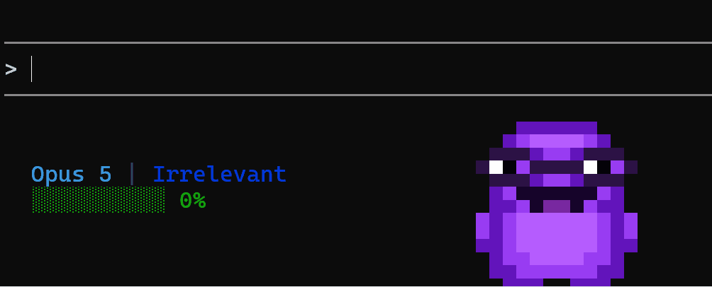
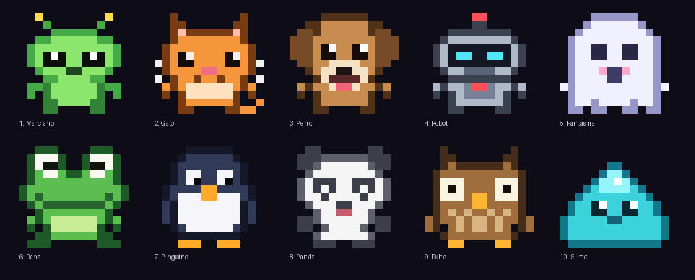

# claude-buddy

Un personaje en pixel art en la barra de estado de [Claude Code](https://code.claude.com), que te acompaña mientras trabajas. Está tranquilo casi todo el tiempo, saluda de vez en cuando, celebra cuando Claude trabaja y se cansa a medida que se llena el contexto.



## Personajes

Por defecto sale **Mr Irrelevant**. Con `/buddy` eliges otro para cada proyecto:



`mr` · `marciano` · `gato` · `perro` · `robot` · `fantasma` · `rana` · `pinguino` · `panda` · `buho` · `slime` · `auto`

Con `auto`, el personaje se elige a partir del nombre de la carpeta, así que cada proyecto conserva siempre el suyo.

## El comando `/buddy`

Sin argumentos abre menús para elegir personaje, tamaño y datos; con argumentos aplica el cambio directo:

```
/buddy                     abre los menús
/buddy gato                cambia el personaje de esta carpeta
/buddy panda mini          personaje y tamaño a la vez
/buddy grande              solo el tamaño
/buddy pegado              deja el personaje junto al texto
/buddy segments model dir git context clock
/buddy reset               vuelve a lo predeterminado
```

Todo se guarda por carpeta (y cubre lo que haya dentro) en `~/.claude/claude-buddy.json`.

**Tamaños:** `mini` (4 líneas, con una versión 8×8 del personaje), `normal` (7 líneas), `grande` (13 líneas).

**Posición:** el personaje va pegado al borde derecho de la terminal, usando el ancho que Claude Code pasa en `COLUMNS`. Con `at` puedes fijarlo en una columna concreta o pegarlo al texto con `0`.

**Segmentos**, en el orden que los escribas: `model`, `dir`, `git`, `context`, `mood`, `clock`, `session` (duración de la sesión) y `lines` (líneas añadidas y quitadas por Claude). Se acomodan solos en varias líneas.

## Qué muestra

- **El personaje**: tranquilo, parpadeando de vez en cuando; a ratos saluda; Mr además mira a los lados y cruza los brazos. Cuando Claude trabaja, celebra con los brazos arriba y chispas.
- **El contexto**: a partir del 50% el personaje se va oscureciendo; por encima del 80% te sugiere hacer `/compact`.
- **Git**: rama, `*` si hay cambios sin commit y `↑` / `↓` para los commits por subir o bajar.
- **Ligero**: Node.js sin dependencias, del orden de 100 ms por actualización.

## Requisitos

- [Claude Code](https://code.claude.com) en la terminal. La barra de estado no existe en la app de chat de Claude.
- [Node.js](https://nodejs.org) 18 o más reciente.
- Git, para la información de la rama (opcional).
- Una terminal con colores de 24 bits (Warp, Windows Terminal, WezTerm, iTerm2…).

## Instalación

En Windows, con PowerShell 7:

```powershell
irm https://raw.githubusercontent.com/tomasmejiar122/claude-buddy/main/install.ps1 | iex
```

O clonando el repo:

```powershell
git clone https://github.com/tomasmejiar122/claude-buddy
cd claude-buddy
./install.ps1
```

El instalador copia `claude-buddy.mjs` y el comando `/buddy` a `~/.claude/`, y configura `statusLine` en `~/.claude/settings.json`. El resto de tu configuración no se toca, y antes de cambiar nada guarda una copia en `settings.json.bak`.

<details>
<summary>Instalación manual (macOS, Linux o Windows)</summary>

Copia `claude-buddy.mjs` a `~/.claude/` y `commands/buddy.md` a `~/.claude/commands/`. Luego añade esto a `~/.claude/settings.json`, ajustando la ruta:

```json
"statusLine": {
  "type": "command",
  "command": "node \"/Users/TU_USUARIO/.claude/claude-buddy.mjs\"",
  "refreshInterval": 2
}
```

</details>

## Configuración

`~/.claude/claude-buddy.json`, que normalmente escribe `/buddy`:

```json
{
  "projects": {
    "c:/code/api": { "character": "gato", "size": "mini",
                     "segments": ["model", "dir", "git", "context"] },
    "c:/code/web": "robot"
  },
  "mode": "buddies",
  "mrIrrelevant": ["c:/trabajo"]
}
```

- `projects`: lo que vale para cada carpeta. Gana la carpeta más específica.
- `mode`: `"buddies"` hace que las carpetas sin configurar usen `auto` en vez de Mr.
- `mrIrrelevant`: carpetas que siempre muestran a Mr. Admite comodines como `*`.
- `character`, `size` y `segments` también se pueden poner en la raíz, como valores por defecto para todo.

## Desinstalar

```powershell
./install.ps1 -Uninstall
```

Quita el `statusLine` de claude-buddy, el comando y el script.

## Personalizar o crear personajes

Los dibujos están en `design/buddies.py`: cada personaje es una cuadrícula de 14×13 letras (una letra por píxel, `.` transparente) más su paleta. Las poses de saludo, celebración y parpadeo se generan solas a partir de los píxeles de los brazos y de los ojos que declares.

```powershell
python design/buddies.py           # dibuja las vistas previas en design/preview/
python design/buddies.py export > design/buddies.json
node design/inject.mjs claude-buddy.mjs
```

Mr Irrelevant vive directamente en `claude-buddy.mjs`, porque tiene poses propias.

## Cómo funciona

Claude Code ejecuta el script cada `refreshInterval` segundos y le pasa por stdin un JSON con los datos de la sesión. El script dibuja la información a la izquierda y el personaje a la derecha, con medios bloques (`▀`): cada carácter muestra dos píxeles, uno con el color de la letra y otro con el color de fondo. El estado de la animación se guarda en un archivo pequeño por sesión en la carpeta temporal. Para saber si Claude está trabajando, mira si el historial de la sesión cambió en los últimos segundos.

## Licencia

[MIT](LICENSE)
